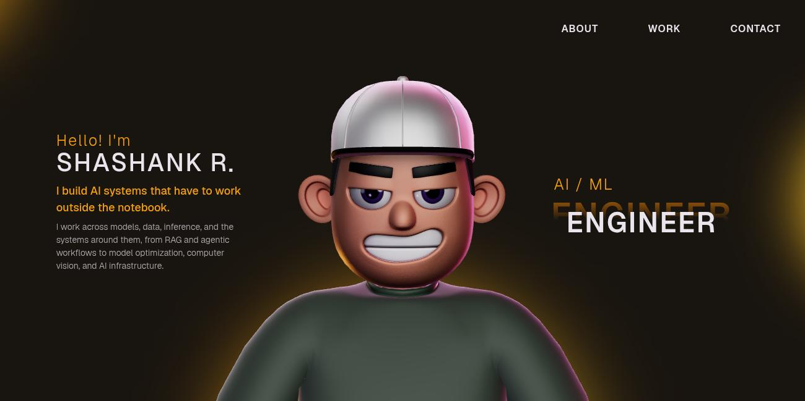

# 3D Portfolio Website

Personal 3D portfolio for Shashank R., an AI/ML engineer. Built with React, TypeScript,
Three.js, React Three Fiber, and GSAP. It includes animated page sections, a 3D character
scene, a custom trail cursor, and scroll-driven transitions.

Live site: [https://shashankr-portfolio.vercel.app](https://shashankr-portfolio.vercel.app)



## Table of Contents

- [Features](#features)
- [Tech Stack](#tech-stack)
- [Project Structure](#project-structure)
- [Getting Started](#getting-started)
- [Available Scripts](#available-scripts)
- [GSAP License Note](#gsap-license-note)
- [Customization Guide](#customization-guide)
- [Troubleshooting](#troubleshooting)
- [Deployment](#deployment)
- [License](#license)

## Features

- Responsive one-page portfolio layout with reusable section components (About, Work,
  Career, Tech Stack, Contact).
- 3D character scene rendering powered by React Three Fiber and Three.js, with a
  password-decrypted, DRACO-compressed glTF character model.
- GSAP-powered scroll choreography (`ScrollTrigger`, `ScrollSmoother`) and text reveal
  animations (`SplitText`).
- Custom canvas-based comet-trail cursor that inverts colors over content
  (`mix-blend-mode: difference`) and hides over interactive elements.
- Project carousel with real case studies, tool lists, and GitHub links.
- Downloadable resume linked from the Contact section.

## Tech Stack

### Core

- React 18
- TypeScript
- Vite

### Animation and 3D

- GSAP + `@gsap/react`
- Three.js
- `@react-three/fiber`
- `@react-three/drei`
- `@react-three/postprocessing`
- `@react-three/cannon`
- `@react-three/rapier`

### Supporting Libraries

- `react-icons`
- `react-fast-marquee`
- `@vercel/analytics`

## Project Structure

```
.
├── public/                    # Static assets (resume PDF, project images, draco/model files)
├── src/
│   ├── assets/                # Local media/assets
│   ├── components/
│   │   ├── Character/         # 3D scene + character load/animation/lighting utilities
│   │   ├── styles/             # Section/component CSS files
│   │   ├── utils/              # GSAP scroll timelines, intro FX
│   │   ├── About.tsx
│   │   ├── Career.tsx
│   │   ├── Contact.tsx
│   │   ├── Cursor.tsx          # Custom trail cursor
│   │   ├── HoverLinks.tsx
│   │   ├── Landing.tsx
│   │   ├── Loading.tsx
│   │   ├── MainContainer.tsx   # Main page composition
│   │   ├── Navbar.tsx
│   │   ├── TechStack.tsx
│   │   ├── WhatIDo.tsx
│   │   ├── Work.tsx
│   │   └── WorkImage.tsx
│   ├── context/                # Loading state provider
│   ├── data/                   # Character bone-name data for animation
│   ├── types/                  # Local type declarations (e.g. GSAP SplitText)
│   ├── App.tsx
│   └── main.tsx
├── package.json
└── vite.config.ts
```

## Getting Started

### Prerequisites

- Node.js 18+ (recommended)
- npm 9+ (or compatible)

### Installation

Clone the repository:

```bash
git clone https://github.com/shashank123r/shashank-portfolio.git
cd shashank-portfolio
```

Install dependencies:

```bash
npm install
```

Start the local development server:

```bash
npm run dev
```

Open the URL shown in the terminal (typically http://localhost:5173).

## Available Scripts

**`npm run dev`**
Starts Vite dev server and exposes host for local network testing.

**`npm run build`**
Type-checks and builds a production-ready bundle.

**`npm run preview`**
Serves the production build locally for verification.

**`npm run lint`**
Runs ESLint checks across the project.

## GSAP License Note

This project uses the standard `gsap` package, which now bundles the previously
"Club GreenSock" plugins (`SplitText`, `ScrollSmoother`) used here.

- Install dependencies with `npm install`.
- No separate license or `gsap-trial` package is required.
- Read official installation guidance here: [GSAP Installation Docs](https://gsap.com/docs/v3/Installation)

## Customization Guide

You can adapt this portfolio to your own profile by updating the following areas:

- **Content sections**: Edit files in `src/components/` such as `About.tsx`, `Career.tsx`,
  `WhatIDo.tsx`, and `Work.tsx` (project entries, descriptions, and GitHub links).
- **Resume**: Replace `public/Shashank_R_Resume.pdf` and update the link in `Contact.tsx`.
- **Theme colors**: Update the CSS custom properties (`--accentColor`, `--backgroundColor`)
  in `src/index.css`, and keep hardcoded duplicates in sync (GSAP color tweens in
  `src/components/utils/initialFX.ts` and `GsapScroll.ts`, light colors in
  `Character/utils/lighting.ts`, SVG assets in `public/images/`).
- **3D scene behavior**: Adjust scene, character, and lighting logic in
  `src/components/Character/`.
- **Cursor**: Tune trail length/easing in `src/components/Cursor.tsx`.
- **Animations**: Tweak GSAP timelines under `src/components/utils/`.

## Troubleshooting

**Blank screen in development**
Check browser console for module import errors and verify all dependencies are installed.

**3D performance issues on low-end devices**
Reduce scene complexity and post-processing effects in the character/scene utilities.

**GSAP plugin errors**
Confirm you're on a recent `gsap` version (`^3.12`) — no separate license is needed for
the plugins used here.

**TypeScript build failures**
Run `npm run build` and address reported type errors before deploying.

## Deployment

Create a production build:

```bash
npm run build
```

Validate locally:

```bash
npm run preview
```

Currently deployed on [Vercel](https://vercel.com), building from the `main` branch of
this repository. To deploy your own copy:

```bash
npx vercel login
npx vercel --prod
```

Or deploy the generated `dist/` folder to any static host (Netlify, Cloudflare Pages, etc.).

## License

This project is open source and available under the [MIT License](LICENSE), derived from
the original template by Rajesh Chityal.
